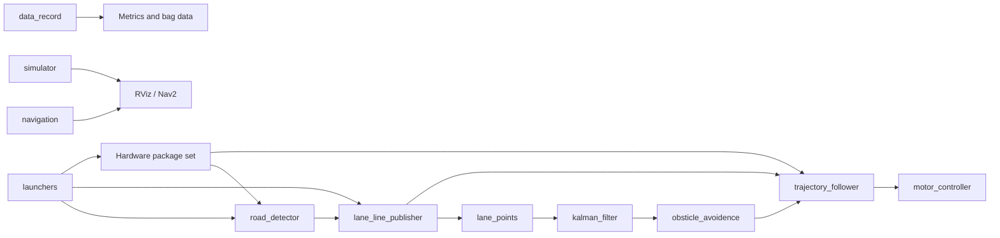

## 13. Software-Related Package Set

### 13.1 Why These Packages Belong Together

This package group exists to transform raw platform capability into application behavior. These packages:

- organize the graph
- produce lane-aware signals
- build controller targets
- smooth or reshape intermediate signals
- run controller variants
- record results
- support simulation and map-based navigation

This is where most Sophia development energy should go after the baseline platform is trustworthy.

### 13.2 The Software Stack at a Glance



### 13.3 `launchers`

#### Role

`launchers` is the orchestration package. It is the first software package a new developer should understand because it expresses how the system is assembled.

It owns:

- shared launch files
- central topic naming
- central frame naming
- shell helpers for sensor and CAN bring-up

#### Why It Matters

Many packages do not hardcode topic names directly. They retrieve them through shared utilities and YAML files managed by this package.

#### Key Launches

| Launch | Purpose |
| --- | --- |
| `all_nodes.launch.py` | baseline hardware and control bring-up |
| `joy.launch.py` | joystick input |
| `teleop.launch.py` | joystick to `cmd_vel` conversion |
| `socket_can_bridge.launch.py` | ROS-to-CAN bridge |
| `vectornav.launch.py` | IMU/GNSS bring-up |
| `zedx_camera.launch.py` | ZED X bring-up |

#### Important Note

Use `all_nodes.launch.py` as the default baseline. Treat `our_all_nodes.launch.py` as a Sophia-side variant that should be validated before relying on it in demos or repeatable tests.

### 13.4 `common_cpp` and `common_python`

#### Role

These are utility packages rather than top-level behaviors.

`common_cpp` provides:

- transform helpers
- geometry conversion helpers
- camera parameter access

`common_python` provides:

- launch utilities
- setup/install helpers
- shared access to topic and frame configuration

#### Why They Matter

These packages reduce duplication. If multiple launch files or nodes behave consistently, it is often because these utility packages are enforcing shared conventions behind the scenes.

### 13.5 `road_detector`

#### Role

`road_detector` is the first perception stage in the lane-following pipeline. It subscribes to the left undistorted image and publishes:

- a mask image
- an annotated visualization image

The node definition shows the interface clearly:

```python
self.image_sub = self.create_subscription(Image, 'sub_image', self.image_callback, buffer_size)
self.annotated_mask_image_pub = self.create_publisher(Image, 'pub_annotated_mask_image', buffer_size)
self.lane_mask_image_pub = self.create_publisher(Image, 'pub_mask_image', buffer_size)
```

#### Typical Start Method

```bash
ros2 launch road_detector road_detector.launch.py
```

#### Key Caveat

The package imports YOLOP from a sibling checkout at runtime. If the model or import path is missing, the node can fail before the ROS 2 graph tells you much.

#### What to Inspect First

```bash
ros2 topic echo /aiformula_perception/road_detector/mask_image
```

Or visualize the annotated mask in RViz or an image viewer topic tool.

### 13.6 `lane_line_publisher`

#### Role

`lane_line_publisher` converts the mask image into lane-line outputs and optional visualizations. It bridges the gap between semantic image output and geometry the controller can use.

Its launch file shows the main idea:

```python
remappings=[
    ("mask_image", topic_names["perception"]["mask_image"]),
    ("lane_lines/left", topic_names["perception"]["lane_lines"]["left"]),
    ("lane_lines/right", topic_names["perception"]["lane_lines"]["right"]),
    ("lane_lines/center", topic_names["perception"]["lane_lines"]["center"]),
]
```

#### Typical Start Method

```bash
ros2 launch lane_line_publisher lane_line_publisher.launch.py
```

You can also enable RViz:

```bash
ros2 launch lane_line_publisher lane_line_publisher.launch.py rviz:=true
```

#### Why It Matters

This package is often the most important perception-stage package after `road_detector`, because it converts "I see a lane-like region" into "here are left, right, and center lane geometries."

### 13.7 `lane_points`

#### Role

`lane_points` turns lane geometry into a small set of target points. The active executables are:

```python
'lane_0215 = lane_points.lane_0215:main',
'lane_0529oa = lane_points.lane_0529oa:main',
```

The `lane_0529oa` variant subscribes to left, right, and center lane line point clouds and publishes processed `Pose2D` points for downstream logic.

#### Typical Start Methods

```bash
ros2 run lane_points lane_0215
ros2 run lane_points lane_0529oa
```

#### Why It Matters

This package is the handoff from lane geometry to controller-friendly target points. It is especially important in the obstacle-aware workflow.

### 13.8 `kalman_filter`

#### Role

`kalman_filter` smooths intermediate values used in lane or motion-related processing.

Available executables:

```python
'kalman0225 = kalman_filter.kalman0225:main',
'withoutkalman = kalman_filter.withoutkalman:main',
'withoutkalman_0312 = kalman_filter.withoutkalman_0312:main',
```

#### Typical Start Methods

```bash
ros2 run kalman_filter kalman0225
ros2 run kalman_filter withoutkalman
ros2 run kalman_filter withoutkalman_0312
```

#### Practical Use

Think of these as processing variants, not just algorithm names. If behavior changes sharply after the lane point stage, this package is one of the first places to compare variants.

### 13.9 `obsticle_avoidence`

#### Role

`obsticle_avoidence` performs path shaping for the obstacle-aware scenario. Its main executable is:

```python
'b_spline = obsticle_avoidence.b_spline:main',
```

#### Typical Start Method

```bash
ros2 run obsticle_avoidence b_spline
```

#### Practical Use

This package belongs in the obstacle-aware pipeline, not in the minimal baseline lane-following pipeline.

### 13.10 `trajectory_follower`

#### Role

`trajectory_follower` is the main controller package in `pid_ws`. It consumes vehicle state and target information, then publishes motion commands.

The `lya_oa` executable makes the control path obvious:

```python
self.create_subscription(Odometry, '/aiformula_sensing/gyro_odometry_publisher/odom', self.odom_callback, 5)
self.velocity_publisher = self.create_publisher(Twist, '/aiformula_control/game_pad/cmd_vel', 10)
```

This package therefore sits between:

- odometry and target trajectories on the input side
- motion commands on the output side

#### Key Executables

| Executable | Typical Use |
| --- | --- |
| `lya_follower_connected_omegat_global` | main lane-following run in the README workflow |
| `lya_oa` | obstacle-aware follower |
| `lya_record` | recording-oriented variant |
| `lya_follower_fixedpath_record` | fixed-path evaluation |
| `lya_baseline_follower_fixedpath_record` | baseline comparison |

#### Typical Start Methods

```bash
ros2 run trajectory_follower lya_follower_connected_omegat_global
ros2 run trajectory_follower lya_oa
```

#### Why It Matters

This package is where "the car should go there" becomes "publish this `Twist` command now."

### 13.11 `data_record`

#### Role

`data_record` is the project's measurement package. It combines:

- a custom metrics message
- a metrics collector node
- a rosbag recording launch flow

The launch file records:

- planned path
- odometry
- controller trajectory
- planner metrics

#### Typical Start Method

```bash
ros2 launch data_record data_record.launch.py
```

#### Practical Note

Because `data_record` uses a mixed Python and message-generation packaging pattern, verify after a fresh build that its node is correctly available before relying on it in an evaluation session.

### 13.12 `navigation`

#### Role

`navigation` wraps Nav2 launch and local map configuration. It is not the primary lane-following path, but it supports map-based navigation experiments.

Typical start method:

```bash
ros2 launch navigation aiformula_navigation_launch.py
```

Useful reference:

- [Nav2 getting started](https://docs.nav2.org/getting_started/)

#### Practical Use

Use this package when:

- you want map-based navigation behavior
- you want RViz with Nav2 bring-up
- you are validating map files and Nav2 parameters

### 13.13 `simulator`

#### Role

`simulator` launches a Gazebo-based environment and reuses the vehicle description pipeline. It is helpful for:

- launch debugging
- environment assumption checks
- testing without live hardware

Typical start method:

```bash
ros2 launch simulator gazebo_simulator.launch.py
```

### 13.14 `auto_launch`

#### Role

`auto_launch` is a convenience launch package for a partial perception pipeline. The included launch currently composes:

- `road_detector`
- `lane_line_publisher`
- `lane_points` using `lane_0215`
- `kalman_filter` using `withoutkalman_0312`

Typical start method:

```bash
ros2 launch auto_launch auto_yolop_launch.py
```

Use it when you want a quick perception-side bring-up without manually starting each node.

### 13.15 How the Software Set Fits Together

If you only remember one split, remember this:

- `launchers` makes the graph coherent
- perception packages create structured lane or road information
- `trajectory_follower` turns that information into motion
- support packages record, smooth, visualize, or simulate the process

That is the useful mental compression of the whole software set.

---
