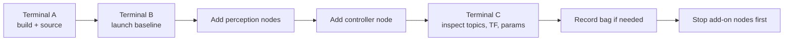

## 15. Commands and Daily Workflow

### 15.1 A Good Daily Rhythm

The fastest way to stay productive in this project is to keep a repeatable command routine. Do not improvise shell state if you can avoid it. Most confusing failures in ROS 2 projects come from one of four causes:

- the wrong workspace is active
- an overlay was sourced in the wrong order
- a node is running but publishing to a different topic than expected
- the hardware baseline was not brought up before the software layer

Treat the workday as a sequence:

1. prepare the shell
2. build only what changed
3. source in the correct order
4. launch the smallest useful runtime
5. inspect topics and nodes before adding more layers
6. record data if the run matters
7. shut down cleanly

### 15.2 Recommended Terminal Layout

For most sessions, three terminals are enough.

- Terminal A: baseline build and source
- Terminal B: runtime launch and node execution
- Terminal C: inspection, diagnostics, bag commands, and quick checks

If you are using both workspaces, keep the controller workspace in a separate shell from the baseline workspace until you are sure the overlay order is correct.



### 15.3 Build the Baseline Workspace

Use the baseline workspace for shared packages, sensing, perception, launchers, navigation, and simulation.

```bash
cd <aiformula-workspace>
source /opt/ros/foxy/setup.bash
colcon build --symlink-install
source install/setup.bash
```

Why this matters:

- `--symlink-install` makes Python-side iteration faster
- sourcing after the build ensures the shell sees the newest package metadata
- keeping the baseline workspace active first reduces overlay confusion later

The official [ROS 2 workspace tutorial](https://docs.ros.org/en/foxy/Tutorials/Beginner-Client-Libraries/Creating-A-Workspace/Creating-A-Workspace.html) and [colcon quick start](https://colcon.readthedocs.io/en/main/user/quick-start.html) are still the right mental model here, even though this project targets ROS 2 Foxy.

### 15.4 Build the Controller Workspace

Use the controller workspace when you need the Sophia controller executables.

```bash
cd <pid_ws-workspace>
source /opt/ros/foxy/setup.bash
source <aiformula-workspace>/install/setup.bash
colcon build --symlink-install
source install/setup.bash
```

The key rule is simple: source the baseline before the controller overlay. If you reverse that order, the controller nodes may start with incomplete package visibility.

### 15.5 Quick Environment Check

Before launching anything expensive, spend ten seconds on a sanity check.

```bash
ros2 pkg list | grep launchers
ros2 pkg list | grep trajectory_follower
ros2 pkg list | grep motor_controller
```

If `trajectory_follower` is missing, the controller workspace is probably not sourced. If `launchers` or `motor_controller` is missing, the baseline workspace is probably not sourced.

### 15.6 Baseline Bring-Up

Use the baseline bring-up first when working with real hardware.

```bash
./init_sensors.sh
ros2 launch launchers all_nodes.launch.py
```

This is the minimum flow for:

- CAN bridge setup
- camera launch
- IMU and GNSS launch
- manual input setup
- motor-controller connectivity
- baseline odometry

If this step is unhealthy, do not jump ahead to lane following or obstacle avoidance.

### 15.7 Perception Stack

When you need the road and lane pipeline without obstacle-aware planning:

```bash
ros2 launch auto_launch auto_yolop_launch.py
```

That launch composes the road detector, lane extraction stages, and the current filtering stage into a single flow that is easier to start and inspect.

If you want to expose each stage separately, use:

```bash
ros2 launch road_detector road_detector.launch.py
ros2 launch lane_line_publisher lane_line_publisher.launch.py
ros2 run lane_points lane_0215
ros2 run kalman_filter withoutkalman_0312
```

This form is slower to start, but much better for debugging.

### 15.8 Lane-Following Controller Run

For the common lane-following controller profile:

```bash
ros2 run trajectory_follower lya_follower_connected_omegat_global
```

Run this only after:

- the baseline launch is healthy
- perception topics are being published
- odometry is available

### 15.9 Obstacle-Aware Controller Run

For the obstacle-aware runtime:

```bash
ros2 launch road_detector road_detector.launch.py
ros2 launch lane_line_publisher lane_line_publisher.launch.py
ros2 run lane_points lane_0529oa
ros2 run kalman_filter withoutkalman_0312
ros2 run obsticle_avoidence b_spline
ros2 run trajectory_follower lya_oa
```

This chain is intentionally modular. It is easier to diagnose because every stage can be inspected independently.

### 15.10 Navigation Run

Navigation is an experimental path that uses the prepared Nav2 integration.

```bash
ros2 launch navigation aiformula_navigation_launch.py
```

Use this when you specifically want a map-based navigation test, not as the default first-day workflow. The official [Nav2 getting started guide](https://docs.nav2.org/getting_started/) is useful for background, but your first success criterion in this project should still be baseline launch health and controller visibility.

### 15.11 Simulation Run

Simulation is the safest place to verify launch composition and TF assumptions.

```bash
ros2 launch simulator gazebo_simulator.launch.py
```

Use simulation when:

- a hardware device is unavailable
- you need to validate a launch change
- you want to inspect the TF tree without involving real sensors

### 15.12 Data Recording Run

When a run should be comparable later, record metrics and bag data together.

```bash
ros2 launch data_record data_record.launch.py
```

For ad hoc bagging:

```bash
ros2 bag record /planned_path /odom /controller/trajectory /planner/metrics
```

For replay:

```bash
ros2 bag info <bag-directory>
ros2 bag play <bag-directory>
```

The official [rosbag tutorial](https://docs.ros.org/en/foxy/Tutorials/Beginner-CLI-Tools/Recording-And-Playing-Back-Data/Recording-And-Playing-Back-Data.html) is a good reference when you want a reminder of playback options.

### 15.13 Daily Inspection Commands

Keep these commands ready in your inspection terminal.

```bash
ros2 node list
ros2 topic list -t
ros2 topic info /aiformula_sensing/gyro_odometry_publisher/odom
ros2 topic echo /aiformula_control/motor_controller/reference_signal
ros2 topic hz /aiformula_sensing/vectornav/imu
ros2 param list
ros2 param get /motor_controller use_handle_controller
ros2 interface show data_record/msg/PlannerMetrics
ros2 run tf2_tools view_frames
```

These commands are more useful than opening source code too early. The official [nodes tutorial](https://docs.ros.org/en/foxy/Tutorials/Beginner-CLI-Tools/Understanding-ROS2-Nodes/Understanding-ROS2-Nodes.html), [topics tutorial](https://docs.ros.org/en/foxy/Tutorials/Beginner-CLI-Tools/Understanding-ROS2-Topics/Understanding-ROS2-Topics.html), and [parameters tutorial](https://docs.ros.org/en/foxy/Tutorials/Beginner-CLI-Tools/Understanding-ROS2-Parameters/Understanding-ROS2-Parameters.html) explain the same workflow at a smaller scale.

### 15.14 Fast Recovery Commands

When a shell gets messy, reset it instead of stacking new `source` commands forever.

```bash
exec bash
source /opt/ros/foxy/setup.bash
source <aiformula-workspace>/install/setup.bash
source <pid_ws-workspace>/install/setup.bash
```

If you are not sure which overlay is active, a fresh shell is usually faster than forensic debugging.

### 15.15 Daily Workflow Summary

If you only remember one habit, remember this:

- baseline first
- perception second
- controller third
- recording fourth
- shutdown in reverse order

---
