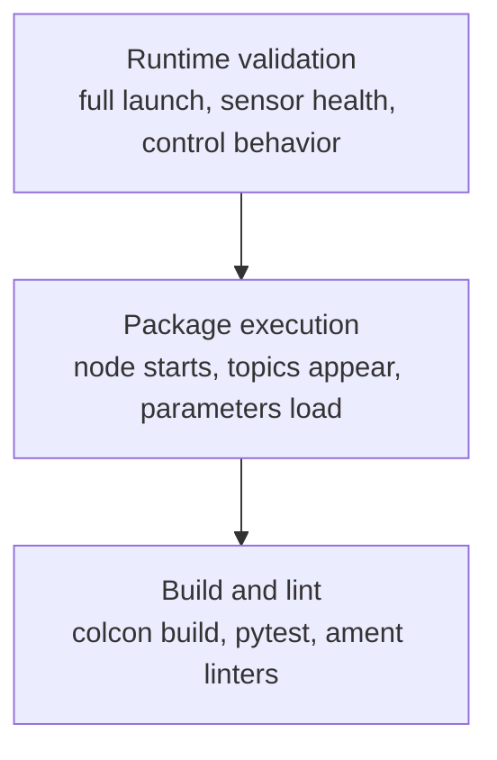

## 18. Testing and Validation

### 18.1 What “Tested” Means in This Project

In this project, “tested” should mean more than “the node starts.”

Good validation covers three levels:

- build and lint checks
- package-level startup checks
- runtime behavior checks on the real or simulated stack

Many local packages already include standard ROS 2 linter tests through `ament_flake8`, `ament_pep257`, `ament_copyright`, or `ament_lint_auto`. That is useful, but it is not enough to prove that perception and control behave correctly at runtime.

### 18.2 Testing Pyramid for This Project



The top layer matters most for actual vehicle work, but the lower layers are the cheapest place to catch mistakes early.

### 18.3 Build and Lint Checks

The first gate is simple:

```bash
colcon build --symlink-install
colcon test
colcon test-result --verbose
```

For a narrower check:

```bash
colcon test --packages-select motor_controller lane_points trajectory_follower
colcon test-result --verbose
```

The official [ROS 2 Python testing tutorial](https://docs.ros.org/en/foxy/Tutorials/Intermediate/Testing/Python.html) and [pytest getting started guide](https://docs.pytest.org/en/stable/getting-started.html) are useful if you want to understand the standard test scaffolding already present in many packages.

### 18.4 What Existing Local Tests Actually Cover

In the current codebase, many tests are quality scaffolding rather than behavior tests. That usually means:

- style conformance
- docstring formatting
- basic package test integration

What they usually do not prove:

- the camera is publishing valid images
- the CAN bridge is healthy
- the lane extractor finds lanes correctly on current data
- the controller tracks well on the actual platform

That is why runtime validation remains essential.

### 18.5 Baseline Validation Sequence

Use this order for a real system health check.

1. verify the workspace and package visibility
2. verify sensor bring-up
3. verify CAN bridge health
4. verify odometry
5. verify teleoperation command flow
6. verify perception outputs
7. verify controller outputs

If one step fails, stop there and fix it before moving on.

### 18.6 Sensor Sanity Checks

Useful checks:

```bash
ros2 topic hz /aiformula_sensing/vectornav/imu
ros2 topic hz /aiformula_sensing/zed_node/left_image/undistorted
ros2 topic echo /aiformula_sensing/vectornav/gnss
```

Look for:

- regular message flow
- fresh timestamps
- values that look plausible rather than frozen or wildly noisy

### 18.7 Odometry Validation

Odometry is central enough that it deserves its own explicit check.

```bash
ros2 topic echo /aiformula_sensing/gyro_odometry_publisher/odom
ros2 topic hz /aiformula_sensing/gyro_odometry_publisher/odom
ros2 run tf2_tools view_frames
```

Pass conditions for onboarding:

- topic exists
- message rate is nonzero and stable
- pose and twist values evolve plausibly
- TF contains the expected base and odom frames

### 18.8 Perception Validation

The minimal perception check is:

```bash
ros2 topic echo /aiformula_perception/road_detector/mask_image
ros2 topic echo /aiformula_perception/lane_line_publisher/lane_lines/center
```

For practical debugging, visual tools are often better than raw text. Use RViz when the launch supports it, and use the annotated perception image when available.

### 18.9 Controller Validation

A controller run is only meaningful if upstream inputs already exist.

Before you trust a controller result, confirm:

- odometry exists
- upstream lane or trajectory inputs exist
- the controller output topic changes over time
- the motor-controller reference signal reflects those changes

Useful commands:

```bash
ros2 topic echo /aiformula_control/game_pad/cmd_vel
ros2 topic echo /aiformula_control/motor_controller/reference_signal
```

### 18.10 End-to-End Validation

For end-to-end validation, the goal is not perfect driving on day one. The goal is a coherent closed chain:

- sensor input is alive
- processing nodes receive data
- perception outputs are published
- controller outputs are published
- actuation reference messages appear

That is the correct first milestone.

### 18.11 Simulation Validation

Use simulation to validate:

- launch composition
- TF publication
- package discovery
- parameter loading

Do not use simulation alone to claim hardware readiness.

### 18.12 Recording for Comparison

A run becomes more useful when you can compare it later.

Recommended approach:

1. record the run
2. save brief notes on what changed
3. compare metrics and playback behavior later

Even a short bag plus a short run log can save hours of memory-based guessing.

### 18.13 Suggested Acceptance Criteria

For a new team member’s first successful session, the bar should be realistic.

Good first acceptance criteria:

- both workspaces build successfully
- baseline launch starts
- sensor topics appear
- odometry appears
- a perception topic appears
- a controller executable starts
- a control command or CAN reference signal appears
- the session can be shut down cleanly

### 18.14 Testing References

Helpful official references:

- [ROS 2 Python testing tutorial](https://docs.ros.org/en/foxy/Tutorials/Intermediate/Testing/Python.html)
- [colcon quick start](https://colcon.readthedocs.io/en/main/user/quick-start.html)
- [pytest getting started](https://docs.pytest.org/en/stable/getting-started.html)

---
