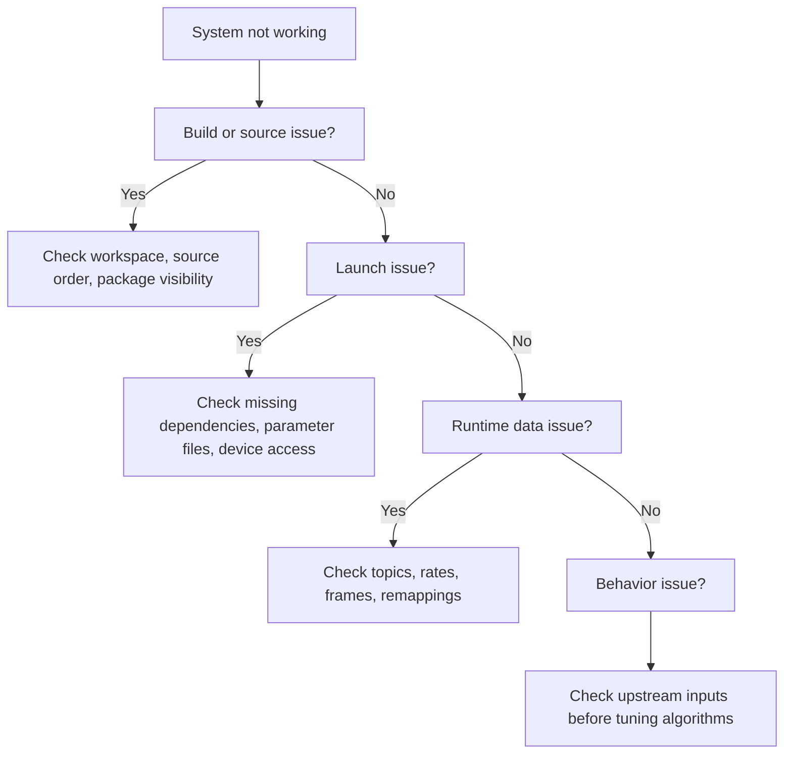

## 19. Troubleshooting

### 19.1 Troubleshoot by Stage, Not by Panic

The fastest way to debug this project is to ask where the failure first becomes visible.



This avoids the common mistake of debugging the controller when the actual failure is an absent sensor topic.

### 19.2 Package Not Found

Symptom:

- `ros2 launch` or `ros2 run` says the package cannot be found

Check:

```bash
ros2 pkg list | grep <package-name>
```

Likely causes:

- workspace not sourced
- wrong shell
- build failed earlier
- overlay sourced in the wrong order

Fix:

1. open a fresh shell
2. source `/opt/ros/foxy/setup.bash`
3. source the baseline workspace
4. source the controller workspace if needed

### 19.3 Launch Fails Immediately

Symptom:

- the launch exits before the runtime graph forms

Check:

- missing dependency packages
- missing external SDK
- bad launch argument
- unavailable device

Helpful commands:

```bash
ros2 launch <package> <launch-file> --show-args
ros2 pkg list
```

### 19.4 Sensor Topic Missing

Symptom:

- no camera, IMU, GNSS, or CAN-driven data shows up

Check in order:

1. did the hardware bring-up run
2. is the device physically connected
3. is the driver node present in `ros2 node list`
4. does the topic exist in `ros2 topic list -t`

If the driver node is not present, solve the launch or device problem first.

### 19.5 CAN Path Missing

Symptom:

- no outgoing reference signal or no incoming vehicle-side feedback

Check:

```bash
ros2 topic echo /aiformula_control/motor_controller/reference_signal
ros2 topic echo /aiformula_sensing/vehicle_info
```

If the control signal exists but the vehicle-side topic does not, the bridge or hardware interface is the likely problem.

The CAN layer depends on [ros2_socketcan](https://github.com/autowarefoundation/ros2_socketcan), so missing bridge behavior may also reflect an external dependency or kernel-side issue rather than a project-local Python bug.

### 19.6 No Odometry

Symptom:

- controller nodes start but do nothing useful

Check:

```bash
ros2 topic echo /aiformula_sensing/gyro_odometry_publisher/odom
ros2 node list
```

If the odometry publisher is absent, inspect the baseline launch. If it is present but silent, inspect its sensor inputs next.

### 19.7 Perception Stack Is Silent

Symptom:

- the road detector or lane extractor starts, but no usable output appears

Debug in this order:

1. confirm image input exists
2. confirm the road mask topic exists
3. confirm lane extraction subscribes to the correct mask topic
4. confirm downstream processing nodes subscribe to the expected lane topic

Do not start tuning filters before confirming the mask exists.

### 19.8 Controller Runs but Vehicle Does Not Respond

Symptom:

- controller node publishes commands, but the platform does not move

Check:

1. the controller output topic
2. the motor-controller input remapping
3. the motor-controller output reference signal
4. the CAN bridge health

If the controller output never changes, the issue is upstream. If the motor-controller reference signal exists, the issue is further downstream.

### 19.9 TF Looks Wrong

Symptom:

- RViz view is inconsistent
- odometry behaves strangely
- transforms appear disconnected

Check:

```bash
ros2 run tf2_tools view_frames
```

Review whether:

- `base_link` exists
- `odom` exists
- camera frames exist
- the graph is connected the way the runtime expects

The official [tf2 overview](https://docs.ros.org/en/galactic/Concepts/About-Tf2.html) is still a good conceptual reference.

### 19.10 Behavior Is Wrong but Topics Exist

This is the important diagnostic split:

- if topics do not exist, you have an integration problem
- if topics exist but values are poor, you may have a tuning or algorithm problem

Only move into tuning once the integration layer is clearly healthy.

### 19.11 Replay and Live Data Got Mixed

Symptom:

- values look reasonable, but behavior is confusing or delayed

Possible cause:

- bag replay and live hardware are active in the same session

Fix:

- stop one data source
- reopen the shell if needed
- restart with a single clear runtime mode

### 19.12 A Good Troubleshooting Habit

When something breaks, write down:

- what command you ran
- what you expected
- the first thing that was missing
- the first thing that was clearly wrong

That short note is often enough to make the second debugging pass much faster.

---
