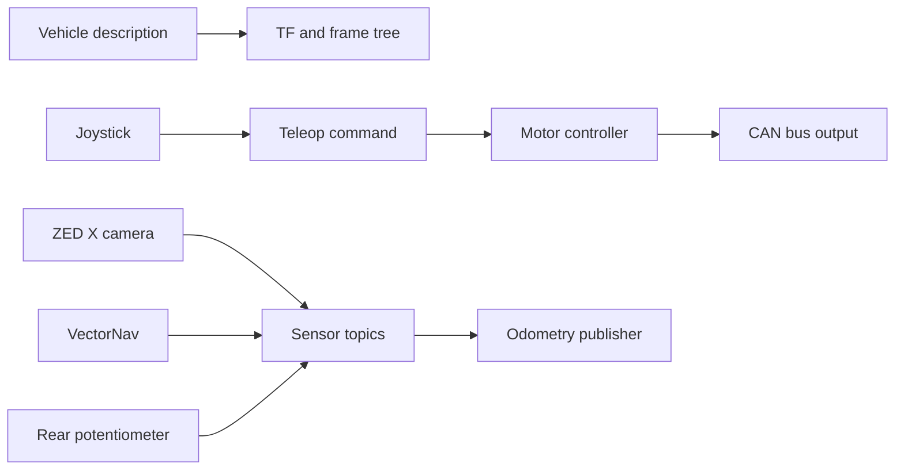
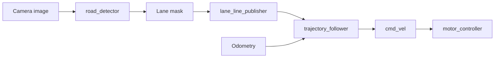
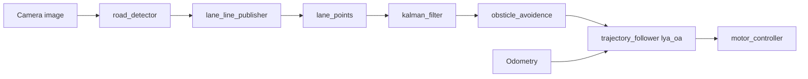

## 8. Sophia System Overview

### 8.1 What Sophia Owns in Practice

Sophia's contribution is best understood as a software layer built on top of a Honda-provided vehicle and hardware baseline. In daily work, that means Sophia is mainly responsible for:

- composing higher-level runtime flows
- lane-centric perception processing
- controller development and comparison
- obstacle-aware extensions
- evaluation and data collection workflows
- keeping the two-workspace development model manageable

This chapter is intentionally practical. Instead of treating Sophia's work as a broad "software contribution," it separates the code into execution profiles you can recognize immediately during testing.

### 8.2 Main Sophia Execution Profiles

The current codebase supports several recurring usage patterns.

| Profile | Main Goal | Typical Workspace Use |
| --- | --- | --- |
| Baseline bring-up | Verify hardware, sensing, actuation, and ROS graph health | `aiformula` |
| Teleoperation | Drive the platform manually and validate command flow | `aiformula` |
| Lane-following stack | Use perception outputs to drive the controller | `aiformula` + `pid_ws` |
| Obstacle-aware stack | Add lane point processing, filtering, and path shaping | `aiformula` + `pid_ws` |
| Navigation experiment | Use Nav2 and a prepared map | `aiformula` |
| Simulation run | Test launch logic and environment assumptions without hardware | `aiformula` |
| Metrics collection | Record planning and trajectory metrics | `aiformula` |

### 8.3 Stable Versus Experimental Code

Not every package in the Sophia layer has the same maturity.

Treat the following as relatively stable entry points:

- `launchers`
- `motor_controller`
- `vectornav`
- `rear_potentiometer`
- `odometry_publisher`
- `lane_line_publisher`
- `trajectory_follower` executables that appear in the README workflows

Treat the following as more experimental or scenario-specific:

- `auto_launch`
- `kalman_filter` variants
- `lane_points` variants
- `obsticle_avoidence`
- some controller variants inside `trajectory_follower`
- alternative launch combinations such as `our_all_nodes.launch.py`

That distinction matters because onboarding should start from proven flows and only then move into variants.

### 8.4 Sophia's Runtime Pipelines

The quickest way to understand Sophia's code is to look at the pipelines it creates.

#### Baseline platform pipeline

#### Lane-following pipeline

#### Obstacle-aware pipeline

### 8.5 A More Useful Way to Think About Ownership

Instead of asking "Which lab wrote this?" ask:

- Which package creates the topic?
- Which package transforms the data?
- Which package turns that data into a command?
- Which workspace must be sourced for that executable to exist?

That question sequence is better for debugging and for onboarding.

### 8.6 What a New Developer Should Learn First

A fast but realistic learning order is:

1. `launchers`
2. hardware-related packages in `aiformula`
3. `road_detector` and `lane_line_publisher`
4. `trajectory_follower`
5. obstacle-aware extensions
6. data recording and navigation

This order mirrors how the runtime stack grows in complexity.

### 8.7 Current Integration Philosophy

The current codebase reflects a layered integration philosophy:

- keep hardware access close to the baseline packages
- centralize topic names and frame IDs
- build perception and controller experiments as add-on modules
- rely on launch composition to define system behavior

That means package boundaries matter. Even when a change looks small, it may affect multiple launch flows.

### 8.8 Where Most New Bugs Appear

In practice, new issues usually appear in four places:

- launch composition
- topic remapping
- workspace sourcing order
- assumptions about upstream topics already existing

Chapters 9-14 are written to reduce exactly those mistakes.

---
