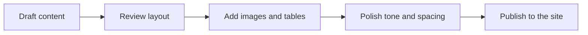

# Content Editing Example

<div class="hero-card fade-up" markdown>

<div markdown>

<p class="eyebrow">TEMPLATE LAB</p>

## A compact playground for page layout and content formatting
Use this page as the editing reference for future sections. It shows how text, images, tables, code, notes, cards, and collapsible blocks can live together without breaking the visual rhythm.
[Open AI Formula](../projects/aiformula.md){ .md-button .md-button--primary }
[Back Home](../index.md){ .md-button }

</div>


</div>

## Text and Rhythm

This paragraph is the baseline body style. It should stay clean, readable, and calm across longer pages. You can mix **bold emphasis**, *soft emphasis*, inline `code`, and standard links such as [Projects](../projects/index.md).

> Use short paragraphs for scanning, and reserve long blocks for material that genuinely needs depth.

- Keep headings clear and descriptive.
- Prefer one idea per paragraph.
- Use lists when the content is naturally list-shaped.

## Image Example


The image block above is a simple way to present diagrams, overview graphics, or visual references without needing a custom component.

## Table Example

| Content Block | Best Use | Editing Note |
| --- | --- | --- |
| Hero section | Opening context and actions | Keep it concise and visual |
| Standard paragraph | Explanations and summaries | Avoid walls of text |
| Table | Comparisons and structured data | Keep column labels short |
| Admonition | Warnings, tips, or notes | Use sparingly for emphasis |
| Tabs | Parallel examples | Good for code or workflows |

## Admonitions and Collapsible Notes

!!! note
    Use a note when the reader should remember a practical detail.

!!! warning
    Use a warning for behavior that can break the build, confuse navigation, or damage data quality.

??? example "Collapsible example"
    This block stays folded by default and is useful for optional details, side examples, or extra commands.

## Tabs Example

=== "Markdown"

    ```md
    ## Section Title

    A short paragraph with **bold text**, `inline code`, and a table below.
    ```

=== "Rendered Result"

    A short paragraph with **bold text**, `inline code`, and a table below.

## Code Example

```python
from pathlib import Path


def collect_pages(root: Path) -> list[str]:
    pages = []
    for path in sorted(root.rglob("*.md")):
        if path.name == "README.md":
            continue
        pages.append(path.as_posix())
    return pages
```

```yaml
nav:
  - Home: index.md
  - Projects:
      - Overview: projects/index.md
      - AI Formula: projects/aiformula.md
```

## Layout Cards

<div class="grid cards fade-seq" markdown>

- **Documentation**

  Keep canonical guides polished, stable, and easy to scan.

- **Experiments**

  Put temporary examples here before they graduate into real pages.

- **References**

  Use visual assets, tables, and code samples as reusable page ingredients.

</div>

## Simple Flow Example



## Mixed Formatting Checklist

- [x] Hero block
- [x] Image example
- [x] Table example
- [x] Admonition sample
- [x] Tabs sample
- [x] Code sample
- [x] Mermaid sample

This page should remain a living editing example rather than a project-specific document.
