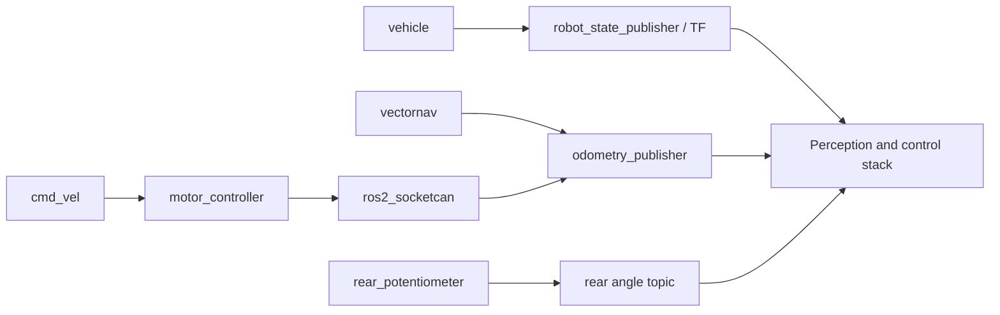

---
title: "12. Hardware-Related Package Set"
description: "AI Formula manual chapter 12."
order: 12
category: "Projects"
source: "aiformula-chapter"
tags:
  - aiformula
  - manual
maintainers: []
---
### 12.1 Why These Packages Are Grouped Together

These packages are grouped together because they anchor the ROS 2 graph to the physical platform. They are closest to:

- the frame tree
- the sensor drivers
- the CAN interface
- the actuator path
- the vehicle state estimate

In practice, they define whether the rest of the stack has a trustworthy platform to run on.

### 12.2 Package Map

| Package | Primary Role | Typical Start Method |
| --- | --- | --- |
| `vehicle` | robot description, frame setup, camera and wheel config | `ros2 launch vehicle extrinsic_tfstatic_broadcaster.launch.py` |
| `vectornav_msgs` | message definitions for the VectorNav stack | built as dependency |
| `vectornav` | IMU/GNSS driver nodes | `ros2 launch launchers vectornav.launch.py` |
| `rear_potentiometer` | rear-angle sensing from incoming vehicle data | `ros2 launch rear_potentiometer rear_potentiometer.launch.py` |
| `motor_controller` | converts `Twist` commands into CAN frames | `ros2 launch motor_controller motor_controller.launch.py` |
| `odometry_publisher` | publishes odometry from sensor and vehicle information | `ros2 launch odometry_publisher gyro_odometry_publisher.launch.py` |

### 12.3 Supporting External Dependency

The CAN sender and receiver path also depends on [ros2_socketcan](https://github.com/autowarefoundation/ros2_socketcan). It is not one of the local package directories, but it is operationally part of the hardware interface layer because it bridges ROS 2 traffic to the CAN device.

### 12.4 Interaction Diagram



### 12.5 `vehicle`

#### Role

`vehicle` is the package that tells the rest of the system what the car is. It provides:

- vehicle geometry
- robot description generation
- static transform relationships
- camera and wheel configuration
- xacro-based model description

It is foundational rather than interactive. You usually do not run it as a standalone business-logic node.

#### What to Start

Typical usage:

```bash
ros2 launch vehicle extrinsic_tfstatic_broadcaster.launch.py vehicle_name:=ai_car1
```

This launch flow converts the vehicle model into a robot description and starts `robot_state_publisher`.

#### Why It Matters

Almost every higher-level package assumes the frame tree from `vehicle` is correct. If the vehicle description is wrong:

- camera frame usage becomes unreliable
- perception outputs can appear in the wrong coordinates
- controller assumptions become inconsistent

#### What to Inspect First

- TF tree
- robot description behavior in RViz
- whether the expected `vehicle_name` is being used

### 12.6 `vectornav_msgs`

#### Role

`vectornav_msgs` is a message-only package. It does not define the operational behavior by itself, but the `vectornav` driver package depends on it.

#### Why It Matters

If this package is missing or broken, the VectorNav driver side may fail to build cleanly. New developers do not usually modify it, but they should recognize its role in the dependency chain.

### 12.7 `vectornav`

#### Role

`vectornav` provides IMU and GNSS-related data through ROS 2 nodes. In the local launch flow, it starts two executables:

```python
vectornav = Node(
    package=PACKAGE_NAME,
    executable="vectornav",
)
vn_sensor_msgs = Node(
    package=PACKAGE_NAME,
    executable="vn_sensor_msgs",
)
```

#### Typical Start Method

```bash
ros2 launch launchers vectornav.launch.py
```

#### What It Contributes

- IMU data into the sensing namespace
- a structured interface for inertial and navigation measurements
- upstream state input for odometry and control

Useful external references:

- [VectorNav SDK](https://www.vectornav.com/resources/detail/vectornav-sdk)
- [ROS 2 launch tutorial](https://docs.ros.org/en/foxy/Tutorials/Beginner-CLI-Tools/Launching-Multiple-Nodes/Launching-Multiple-Nodes.html)

#### What to Inspect First

```bash
ros2 topic list | grep vectornav
ros2 topic echo /aiformula_sensing/vectornav/imu
```

#### Common Failure Modes

- missing serial permissions
- wrong device assumption
- launch succeeds but no useful sensor data appears

### 12.8 `rear_potentiometer`

#### Role

`rear_potentiometer` publishes a rear-angle-related signal from incoming vehicle-side information. Its launch remappings make the role very clear:

```python
remappings=[
    ("pub_rear_wheel_yaw", TOPIC_NAMES["sensing"]["rear_potentiometer"]),
    ("sub_can", TOPIC_NAMES["sensing"]["input_can_data"]),
]
```

#### Typical Start Method

```bash
ros2 launch rear_potentiometer rear_potentiometer.launch.py
```

#### What It Contributes

- a vehicle state signal that downstream software can use
- a bridge from incoming CAN-derived data to a ROS-native topic

#### What to Inspect First

```bash
ros2 topic echo /aiformula_sensing/rear_potentiometer/yaw
```

If this topic stays silent while CAN traffic is otherwise healthy, the problem is likely upstream or in remapping assumptions.

### 12.9 `motor_controller`

#### Role

`motor_controller` is one of the most important packages in the system because it turns motion commands into CAN output.

Its core runtime logic is straightforward:

```python
self.twist_sub = self.create_subscription(Twist, 'sub_speed_command', self.twist_callback, buffer_size)
self.can_pub = self.create_publisher(Frame, 'pub_can', buffer_size)
```

The node:

1. subscribes to a `Twist` command
2. converts linear and angular motion into wheel RPM references
3. packs those references into a CAN frame
4. publishes the frame for the CAN bridge

#### Typical Start Method

```bash
ros2 launch motor_controller motor_controller.launch.py
```

Or directly:

```bash
ros2 run motor_controller motor_controller
```

#### Why It Matters

This package sits at the boundary between motion logic and actuation. If the controller is wrong, everything upstream can look healthy while the car still behaves incorrectly.

#### What to Inspect First

```bash
ros2 topic echo /aiformula_control/game_pad/cmd_vel
ros2 topic echo /aiformula_control/motor_controller/reference_signal
```

Check whether a valid `Twist` is entering, and whether a `can_msgs/Frame` is leaving.

#### Common Failure Modes

- no incoming `Twist`
- wrong wheel or gear parameters
- CAN frame being published but no CAN transport active
- command saturation or conversion assumptions producing unexpected motion

### 12.10 `odometry_publisher`

#### Role

`odometry_publisher` turns sensor and vehicle information into odometry outputs. The package exposes at least two compiled executables:

- `gyro_odometry_publisher`
- `wheel_odometry_publisher`

The common workflow in this repository uses the gyro-based launch.

#### Typical Start Method

```bash
ros2 launch odometry_publisher gyro_odometry_publisher.launch.py
```

#### Runtime Inputs

From the launch definition, the gyro-based publisher consumes:

- ZED IMU input
- vehicle-side CAN information

And publishes:

- gyro odometry on the sensing side

#### Why It Matters

Most Sophia controller logic assumes that odometry is available and trustworthy enough to use as the vehicle state estimate. If odometry is missing or unstable, controller debugging becomes meaningless.

#### What to Inspect First

```bash
ros2 topic echo /aiformula_sensing/gyro_odometry_publisher/odom
```

If you need visualization:

```bash
ros2 launch odometry_publisher gyro_odometry_publisher.launch.py use_rviz:=true
```

#### Common Failure Modes

- IMU topic missing
- CAN topic missing
- frame mismatch
- odometry exists but drifts or jumps unexpectedly

### 12.11 Validation Sequence for the Hardware Package Set

Use this order:

1. validate `vehicle` and TF
2. validate `vectornav`
3. validate CAN bring-up and `ros2_socketcan`
4. validate `rear_potentiometer`
5. validate `motor_controller`
6. validate `odometry_publisher`

That sequence moves from platform description to sensing to actuation to derived state.

### 12.12 What New Developers Should Not Change First

Avoid editing these packages early unless you already know the failure mode:

- vehicle geometry and static transforms
- wheel and gear parameters
- IMU launch defaults
- CAN assumptions
- odometry frame definitions

These are baseline trust anchors. If you change them casually, many higher-level problems become harder to interpret.

---
